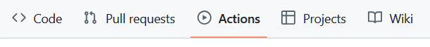
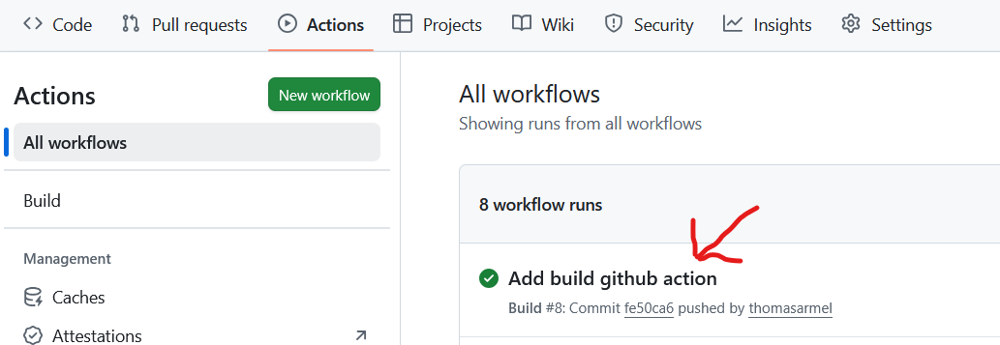
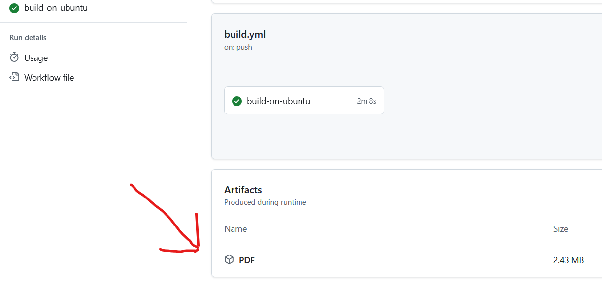
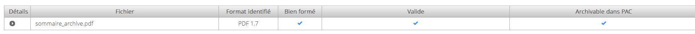

# these-I3S

## Français

### Présentation

Vous trouverez ici un modèle de thèse en latex avec pour [couverture celle demandée par Université Côte d'Azur](https://bu.univ-cotedazur.fr/fr/utiliser-nos-services/deposer-sa-these-ou-son-memoire/deposer-sa-these-de-doctorat).

Les macros `\hdr` et `\master` permettent de spécifier que le document est respectivement pour une habilitation à diriger les recherches et pour une mémoire de master.

:point_right: N'hésitez pas à poster des issues ou faire des pull-request pour améliorer ce modèle.

### Validation automatique du code LaTeX

Une pipeline GitHub Actions compile automatiquement le projet à chaque nouveau commit. Les tests de build sont lancés sur les plateformes suivantes:

- :penguin: Ubuntu avec pdflatex
- :keycap_ten: Windows avec MikTex
- :apple: MacOS avec MacTex

Ainsi, vous avez la garantie que le code LaTeX compile correctement à chacune de vos modifications sur toutes ces plateformes, si les jobs réussissent !

### Génération automatique des PDFs compilés

Une fois les jobs terminés, vous pourrez alors télécharger les PDFs compilés sur chacune des plateformes directement dans les artefacts GitHub Actions:

Aller dans l'onglet **Actions**:

Sélectionner le dernier Workflow, correspondant à votre commit:

Enfin, télécharger les fichiers PDFs compilés sur chacune des plateformes:

Un artefact prêt à l'archivage, directement compatible avec le format Facile CINES (https://facile.cines.fr/) est aussi automatiquement généré:

:white_check_mark: Il devrait alors être possible d'envoyer ce PDF directement sur ADUM !

## English

### Presentation

You'll find here a Ph.D. thesis template in latex with the [first page requested by Université Côte d'Azur](https://bu.univ-cotedazur.fr/fr/utiliser-nos-services/deposer-sa-these-ou-son-memoire/deposer-sa-these-de-doctorat).

The macros `\hdr` and `\master` specify that the thesis is respectively for a *habilitation à diriger les recherches* and for a master thesis.

:point_right: Do not hesitate to post issues or pull requests to improve this model.

### Automatic LaTeX code validation

A GitHub Actions pipeline automatically compiles the project with each new commit. Build tests are run on the following platforms:

- :penguin: Ubuntu with pdflatex
- :keycap_ten: Windows with MikTeX
- :apple: macOS with MacTeX

This guarantees that the LaTeX code compiles correctly with each change on all these platforms, provided the jobs are successful!

### Automatic generation of compiled PDFs

Once the jobs are complete, you can download the compiled PDFs on each platform directly from the GitHub Actions artifacts:

Go to the **Actions** tab:

Select the last workflow, corresponding to your commit:

Finally, download the compiled PDF files on each platform:

An archiving-ready artifact, directly compatible with the Facile CINES format (https://facile.cines.fr/), is also automatically generated:

:white_check_mark: It should then be possible upload this PDF directly to ADUM!